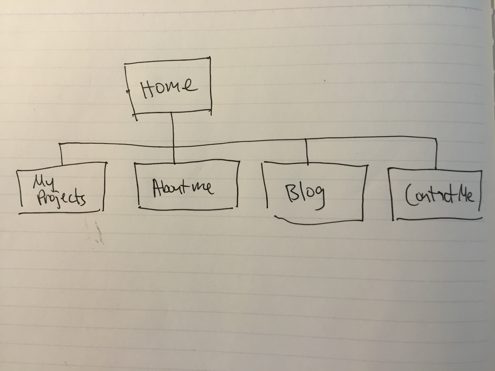

#What are the 6 Phases of Web Design?
Information Gathering
Planning
Design
Development
Testing & Delivery
Maintenance

#What is your site's primary goal or purpose? What kind of content will your site feature?
My site's primary purpose is to showcase my programming knowledge and projects. Besides general information about who I am (LinkedIn and brief biography), I'll be including mainly projects that I'll be working on in the coming months ahead.

#What is your target audience's interests and how do you see your site addressing them?
My target audience is primarily recruiters and other developers who may become collaborators with me down the road. I see my site as a canvas for demonstrating my technical skills in addition to the soft skills I have developed over years as an entrepreneur in a foreign country. My blog will simultaneously serve as a medium for sharing (and contrasting) my experiences abroad relative to America.

#What is the primary "action" the user should take when coming to your site? Do you want them to search for information, contact you, or see your portfolio? It's ok to have several actions at once, or different actions for different kinds of visitors.
I'll try to present my site in such as way that both my personal information and my portfolio is equally prominent. Then if they're interested in who I am and curious to learn more, they can then click on the contact page. This is also why in my sitemap, the first two links are 'My Projects' and "About Me".

#What are the main things someone should know about design and user experience?
Design and User Experience(UX) are both considered front-end development, which has to do with what users see and feel. If you consider back-end programming as a skeleton, providing the infrastructure for the technical functions of a project, then front-end would be the aesthetics and 'muscle-finesse' that dictates how pleasant a website is to navigate, both efficiency-wise, and aesthetic-wise.

That said, I believe front-end design is just as critical as back-end design.

#What is user experience design and why is it valuable?
UX design is the process of addressing how a user feels when they are navigating a webpage. For instance, deciding whether a 'BUY' button is red or green, or whether a products image is placed on the left or right hand side of a webpage could theoretically influence a user's decision. Although the influence may be subtle, on large scales, a 2-5% fluctuation can mean significant influence on the bottom line.

UX is valuable because it can influence user psychology to impact user retention, user interaction, and of course, sales.

#Which parts of the challenge did you find tedious?
It was a lot of reading and video watching that was a bit hard to comprehend because of a lack of context, making the ideas seem a bit abstract and hard to retain. I think if we had simultaneously been building (or completed building) a site before reading and watching the material, it would've been more engaging, and definitely would've been much easier to retain.