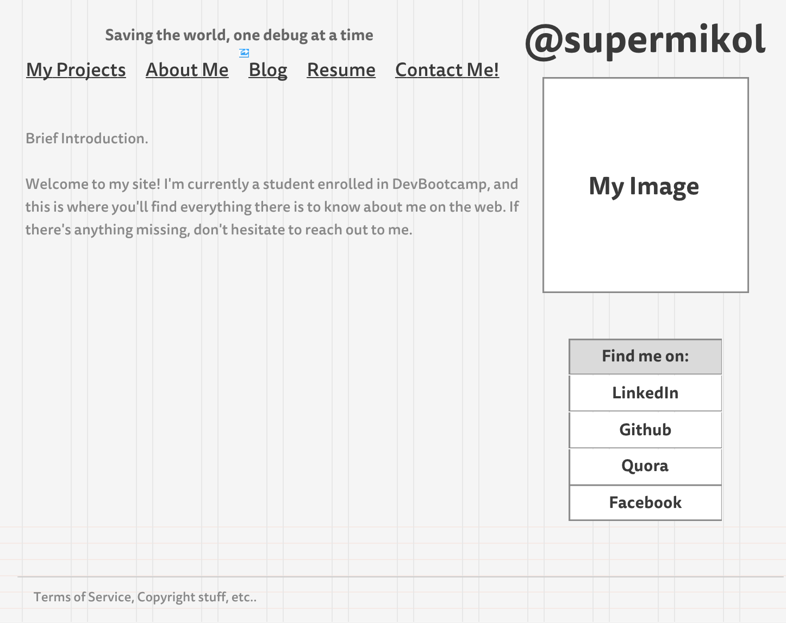
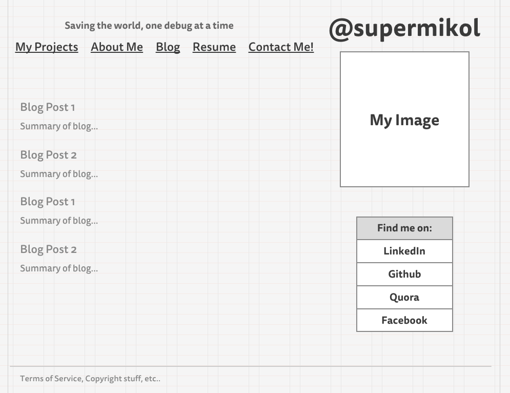

#What is a wireframe?
A wireframe is a simple sketch-up of how a site looks visually. Content is usually not needed, and instead we'll only have frames and simple text indicating where the placement of an image, logo, button, or text will be. You can call it the 'skeleton' providing the frame and structure of a website.
#What are the benefits of wireframing?
Wireframes are much easier to draw up and modify, which makes sense to work with early in a project when deciding the structure for a website, instead of wasting time filling in with details that may eventually not be included in the final design. Also, a wireframe in some instances can provide a clearer picture of how a user interacts with a site, without being distracted by minute details.
This preliminary stage will eventually save both parties (developer and owner) time and money.
#Did you enjoy wireframing your site?
Having to learn a new tool during the process made it less enjoyable than it could've been (I used gomockingbird.com). Maybe with more experience and a better idea of what the final product will look like, I'll be more excited about it.
#Did you revise your wireframe or stick with your first idea?
It was kind of a work-in-progress. I didn't really envision a certain layout from the get-go, besides the fact that the navigation bar was going to be on the top. Everything else I just threw in and played around with until it looked pleasant enough.
#What questions did you ask during this challenge? What resources did you find to help you answer them?
Part of the challenge was knowing what a typical wireframe looked like, and the level of detail that went into it. The "Beginner's guide to wireframing" really gave me a good idea of where to start, and what the finished product should look like.
#Which parts of the challenge did you enjoy and which parts did you find tedious?
The part I enjoyed most was the sketching, but the tool itself was what I found tedious. I can see why most people will opt for Adobe Illustrator/photoshop.