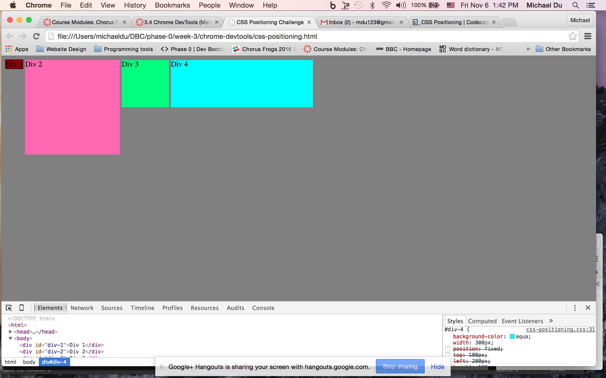
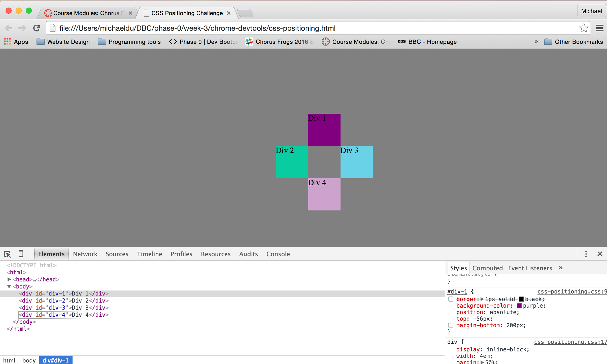

#####How can you use Chrome's DevTools inspector to help you format or position elements?
The DOM interface as part of Chrome's DevTools allow us to directly modify and add CSS attributes and values, allowing us to effectively gauge how the site will appear as each code is being changed.

#####How can you resize elements on the DOM using CSS?
By setting the height and width style attributes, we can manipulate blocks into whatever size we want.

#####What are the differences between absolute, fixed, static, and relative positioning?
Static is the default positioning, and which ignores the top, right, bottom, left positionining.
Relative allows us to position the object relative to where it would have originally been in 'static'.
Absolute is positioning relative to closest positioned ancestors, and are 'ignored' by other objects in positioning. This means objects can stack on top or below absolute objects.
Fixed objects are similar to absolute in that they are also ignored by other objects in their positioning, but in addition to that, they also remain fixed on a specific location of the screen, even if it is scrolled. From my understanding, they work like Absolute positioning, except that they are permanently positioned relative to the HTML frame.

#####Which did you find easiest to use? Which was most difficult?
The easiest one to use is relative, because it allows us flexibility while being predictable (it's default position is the same as static). The most difficult one was absolute, because I couldn't get it to work properly with margins, and the divs were going all over the place.

#####What are the differences between margin, border, and padding?
Border is the line that wraps the object.
Margin is the spacing you want an object to have in between other objects. (the space between borders of two objects)
Padding is the spacing between the content of the object box (for example text) and the border of the box. This is the spacing within the object.

#####What was your impression of this challenge overall? (love, hate, and why?)
I won't go as far as to say I hate it, but right now, I get the feeling that CSS is not something I want to sit around doing for the rest of my life. It's great that I can create/work with basic layouts though, so I'm happy with that.